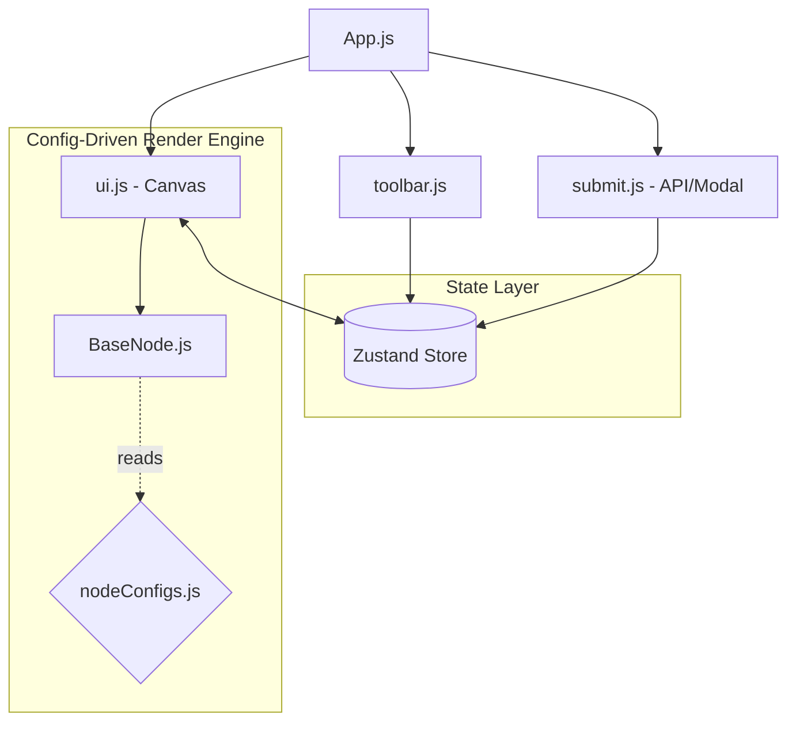
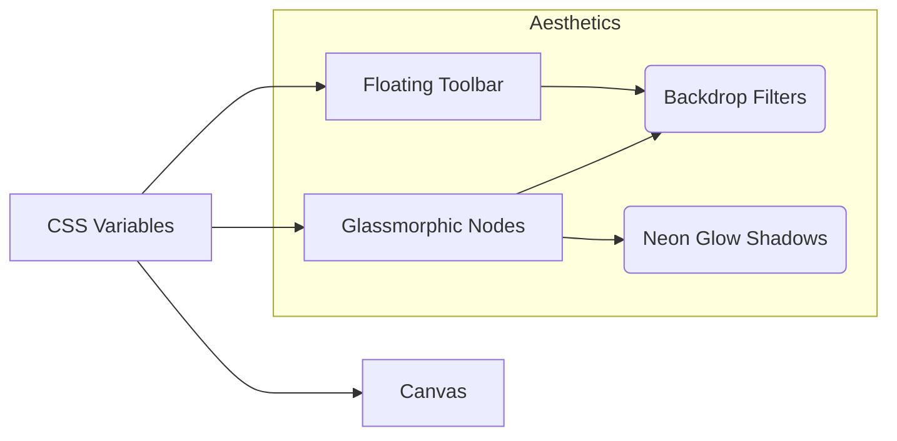

<div align="center">
  
  
  
</div>

<h1 align="center">Frontend System Design & Architecture</h1>

This document outlines the frontend system architecture for the VectorShift Visual Pipeline Builder. The application is engineered for **O(1) scalability** when adding new node types, **zero-prop-drilling** state management, and a highly polished **Cyber-Glass UI**.

---

## 🏗️ 1. High-Level Architecture Diagram

The frontend is decoupled into three primary layers: **UI Presentation**, **State Management**, and **Business Configuration**.



---

## ⚙️ 2. The Config-Driven Engine (Zero Duplication)

Standard ReactFlow implementations suffer from massive code duplication (e.g., creating `InputNode.js`, `LLMNode.js`, `OutputNode.js` with identical wrapper HTML/CSS). This project uses a **Config-Driven Architecture**.

### How it works:
1. **`nodeConfigs.js`**: Acts as a pure data dictionary. Every node type is defined strictly by its metadata (fields, handles, colors, icons).
2. **`BaseNode.js`**: A universal rendering engine. It maps over the configuration dictionary to dynamically generate the UI, inputs, and ReactFlow `<Handle />` components.

> [!TIP]
> **Scalability:** Adding 50 new node types requires **0 lines of new React code**. You simply append new objects to the configuration dictionary, and the UI dynamically generates them.

---

## 🧠 3. Advanced Text Node Logic (Dynamic DOM & Regex)

The Text Node requires specialized behavior beyond the generic config. It implements two advanced frontend patterns:

### A. Auto-Resizing Layout
Instead of relying on fixed dimensions or manual CSS `resize` handles, the `textarea` dynamically calculates its `scrollHeight` on every keystroke. This allows the node card to fluidly expand and collapse, maintaining visual harmony on the canvas without overlapping other nodes.

### B. Instant Regex Handle Spawning
We use a real-time regex parser (`/\{\{([a-zA-Z_$][a-zA-Z0-9_$]*)\}\}/g`) bound to the `onChange` event of the textarea. 
1. As the user types `{{variable}}`, the regex intercepts the string.
2. It dynamically injects a new ReactFlow target `<Handle>` into the DOM.
3. The handles automatically calculate their vertical offsets (`top: %`) to distribute themselves evenly across the left boundary of the node.

---

## 🎨 4. "Cyber-Glass" Design System

The UI relies entirely on vanilla CSS variables (`index.css`), completely bypassing heavy component libraries (like MUI or Tailwind) to ensure maximum performance and pixel-perfect control.



### Key UI Features:
- **Glassmorphism:** Heavy use of `backdrop-filter: blur(16px)` layered over `rgba` backgrounds creates a frosted-glass effect across the toolbar, nodes, and modals.
- **Canvas Depth:** The `react-flow__background` SVG dots are layered seamlessly to give the infinite canvas a feeling of depth.
- **Micro-Interactions:** Custom `@keyframes` (pulse, gradientShift) enhance interactivity without blocking the main thread.

---

## 💾 5. State Management (Zustand)

We selected **Zustand (v4.4.1)** over Redux or React Context. 
- **Why not Context?** React Context causes full-tree re-renders on every state change. When dragging a node across the canvas at 60fps, Context would cause massive frame drops.
- **Why Zustand?** Zustand allows component-level subscriptions (`useStore(selector, shallow)`). When a node moves, only that specific node re-renders. 

```javascript
// O(1) state updates from anywhere in the app without prop-drilling
const updateNodeField = useStore((state) => state.updateNodeField);
```

---

## 🌐 6. Network Layer (submit.js)

The submission layer decouples the canvas state from the backend logic. 
- Extracts the active `nodes` and `edges` from Zustand.
- Sends a sanitised payload to the FastAPI backend via `fetch`.
- Catches network failures gracefully and mounts the glassmorphic `<ResultModal />` with dynamic entering animations (`slideUp`).
